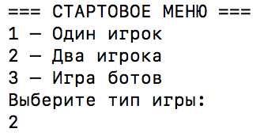
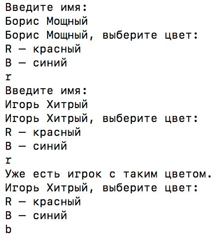
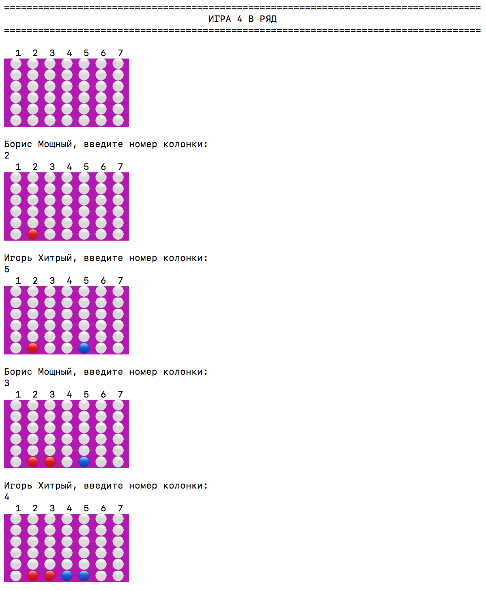
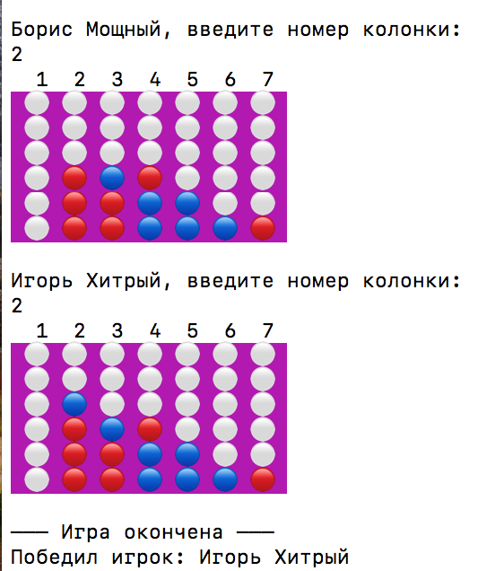
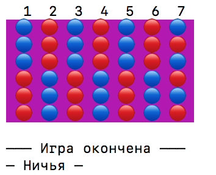

# Игра "4 в ряд"

## Правила
Игра, в которой игроки ходят по очереди, "роняя" фишки в ячейки вертикальной доски. 

Цель игры — расположить раньше соперника подряд по горизонтали, вертикали или диагонали четыре фишки своего цвета.

## Игровой процесс
Перед стартом выбирается тип игры:

Затем каждый игрок вводит имя и выбирает цвет.

После этого игра начинается и игроки по очереди делают ходы:

Игрок выигрывает, когда собирает 4 своих фишки в один ряд:

Если вся доска заполняется фишками и при этом нет победителя — игра заканчивается в ничью:

